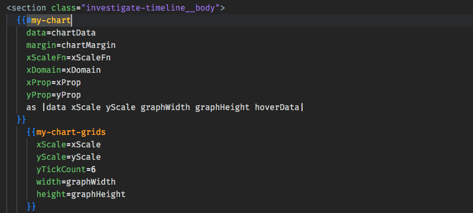
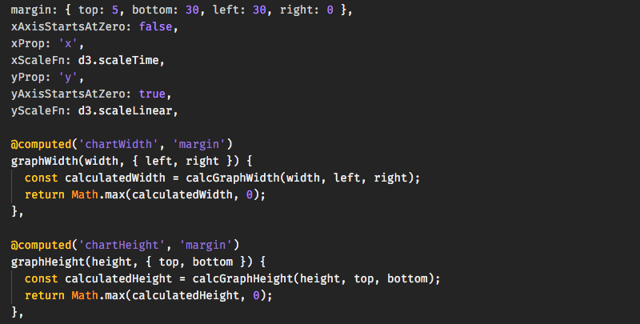

# README:
VsCode extension that colorizes/tokeninzes Ember `.hbs`, Controllers, and Routes files.

Issues: https://github.com/gtb104/vscode-ember-colorizer/issues

Change Theme: `Shift+CMD+P` -> Search `Preferences: Color Theme` -> Switch to `Ember Snow`

## Theme:
* Handlebars:

* Javascript:
 	

## Notes:
Use in conjunction with [vscode-bable-coloring](https://github.com/gtb104/vscode-babel-coloring)

### Credits:
Based off of: https://github.com/ciena-blueplanet/vscode-ember-colorizer
